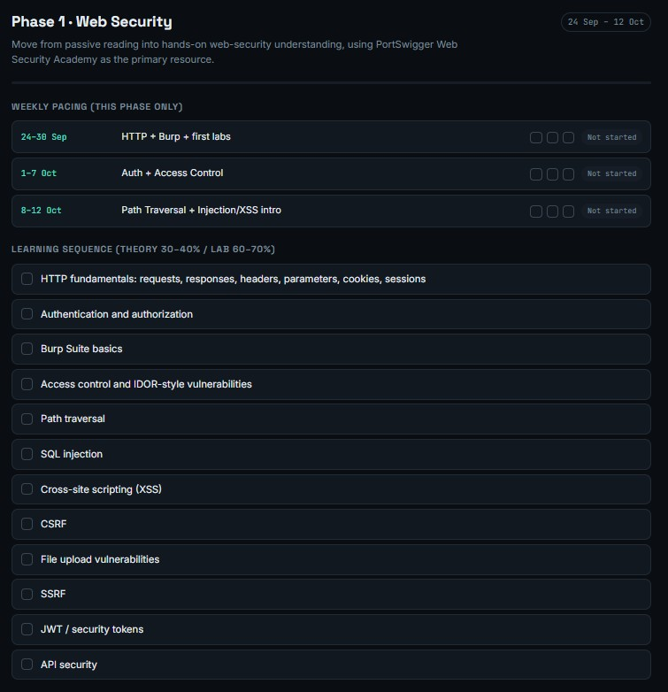

# Bug-Hunting-Learning
A practical learning journey from web security and bug hunting to Cloud Security and AI Security, with hands-on labs, methodologies, notes, and progress tracking.

## 🚀 Overall Progress

> This bar is a live-rendered image, not a script — GitHub won't run JS in a README, so there's no way to make it auto-update on its own. Update it manually after each week by editing the number in the URL above (`.../8/` → `.../16/` etc, out of 100), or ask me to wire up a GitHub Action that recalculates it automatically from the checklist below on every commit.

## 📍 Phase 1 — Web Security Foundations

**Goal:** Go from zero to confident with Linux, networking, web fundamentals, and core web vulnerabilities (SQLi, XSS, Auth/IDOR, SSRF).
**Timeline:** Weeks 1–8 · Started 4 Oct 2026

| Week | Topic | Status |
|---|---|---|
| 1 | Linux & WSL mastery | ✅ In progress |
| 2 | Networking fundamentals | ⬜ Not started |
| 3 | Web fundamentals & Burp Suite | ⬜ Not started |
| 4 | Recon & enumeration | ⬜ Not started |
| 5 | Injection basics (SQLi) | ⬜ Not started |
| 6 | XSS & client-side | ⬜ Not started |
| 7 | Auth & access control | ⬜ Not started |
| 8 | SSRF, XXE, deserialization | ⬜ Not started |

### Phase 1 Checklist
- [x] Set up WSL + Ubuntu 26.04
- [x] Linux fundamentals — navigation, file ops, permissions & ownership
- [ ] Complete OverTheWire Bandit (levels 0–15)
- [ ] Networking fundamentals (TCP/IP, DNS, HTTP/HTTPS)
- [ ] Burp Suite basics set up and used in a lab
- [ ] First SQLi lab solved (PortSwigger / DVWA)
- [ ] First XSS lab solved (PortSwigger)
- [ ] First IDOR found in a lab
- [ ] First SSRF lab solved

> Tick a box by changing `- [ ]` to `- [x]` and committing — GitHub renders it as a checked checkbox immediately, no tooling needed. This is your real-time progress log.

## 🗺️ Upcoming Phases
- **Phase 2 — Cloud Security:** AWS/Azure misconfigurations, IAM, privilege escalation
- **Phase 3 — Bug Bounty Methodology:** recon-to-report workflow, live scope hunting, write-ups
- **Phase 4 — AI Security:** emerging LLM/AI-specific attack surface
